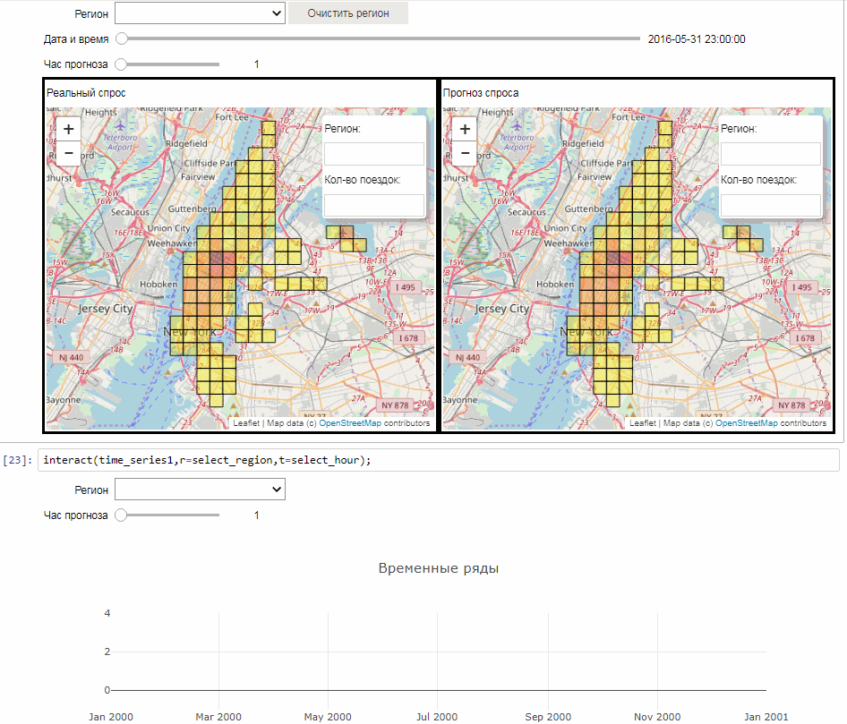

# First_project
## Описание проекта

Данный проект является последним заданием в курсе "Машинное обучение и анализ данных" (<https://www.coursera.org/learn/data-analysis-project/home/welcome>). В рамках курса исследовались данные о поездах в желтом такси Нью-Йорка. Итогом работы стало построение регрессионной модели и прогноз спроса поездок из некоторых областей города на 6 часов вперед. 

В качестве регрессора был выбран Lasso регрессор. Обучение модели происходило на данных с января по апрель 2016 года включительно. Настройка парметров осуществлялась на данных за май 2016 года, а прогноз был построен на июнь.

Данный проект представляет собой интерактивную визуализацию результатов работы.  
Для запуска ноутбука (Taxi.ipynb) достаточно нажать на следующую кнопку

**Важно:** открытие ноутбука на сервере занимает некоторое время. После того, как ноутбук загрузится, необходимо будет нажать кнопку Restart & Run All (как при  обычной работе с ipython notebook). 

Ниже представлены гифки с работой виджетов.

---

---

